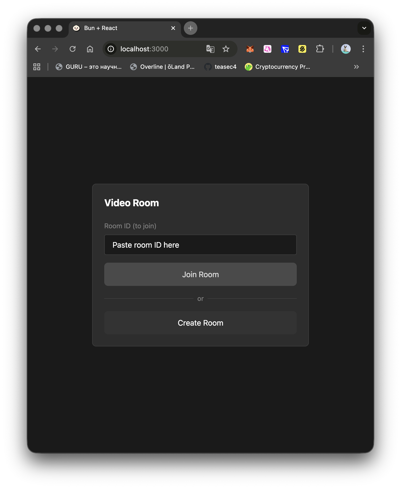
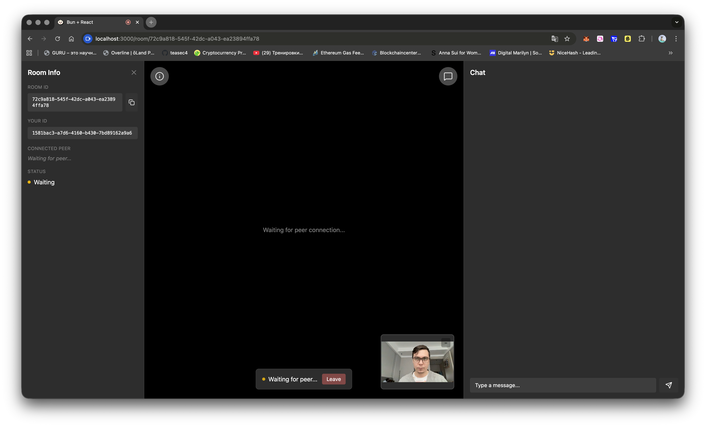
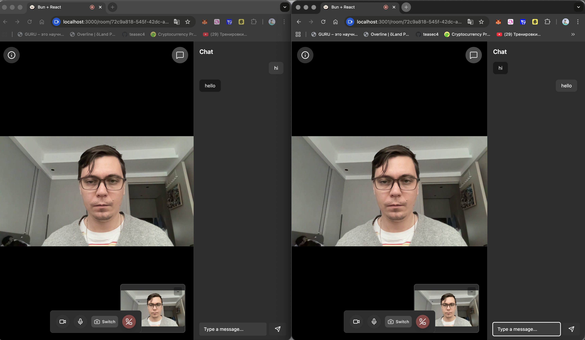

# Video Call App

[](https://bun.com)
[](https://react.dev)
[](https://www.typescriptlang.org)
[](https://tailwindcss.com)
[](LICENSE)

A real-time video calling application built with Bun, React.

## Screenshots

### Home Page


### Create Room Call


### Video Call


## Features

- Real-time peer-to-peer video calling
- Clean, responsive UI
- Dark mode support
- WebSocket-based communication

## Getting Started

### Prerequisites
- [Bun](https://bun.com) v1.3.3+

### Installation

```bash
bun install
```

### Development

```bash
bun dev
```

### Production

```bash
bun start
```

## Tech Stack

- **Runtime**: [Bun](https://bun.com)
- **Frontend**: React 19, TypeScript
- **Styling**: Tailwind CSS
- **Routing**: React Router
- **Icons**: Lucide React
